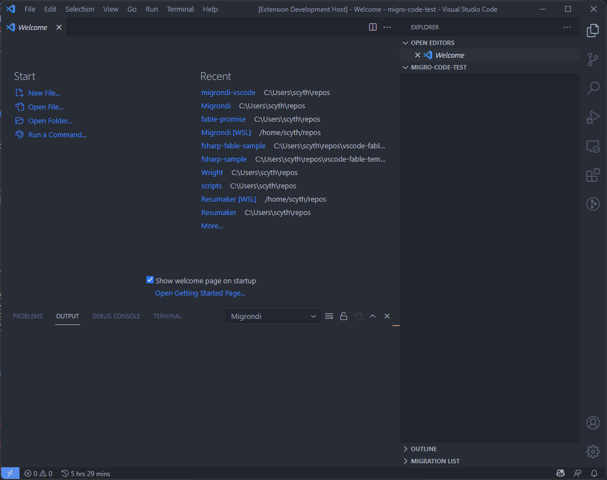
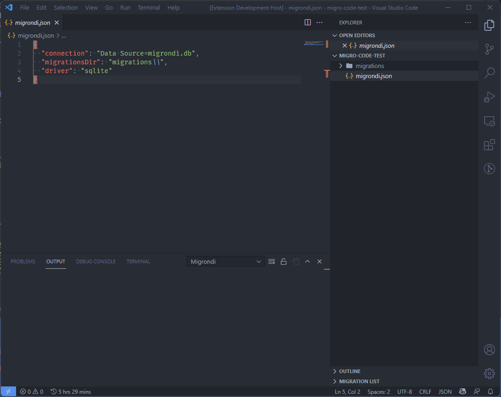
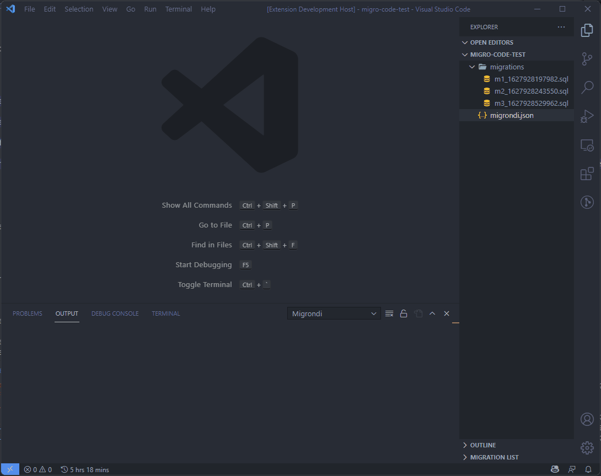
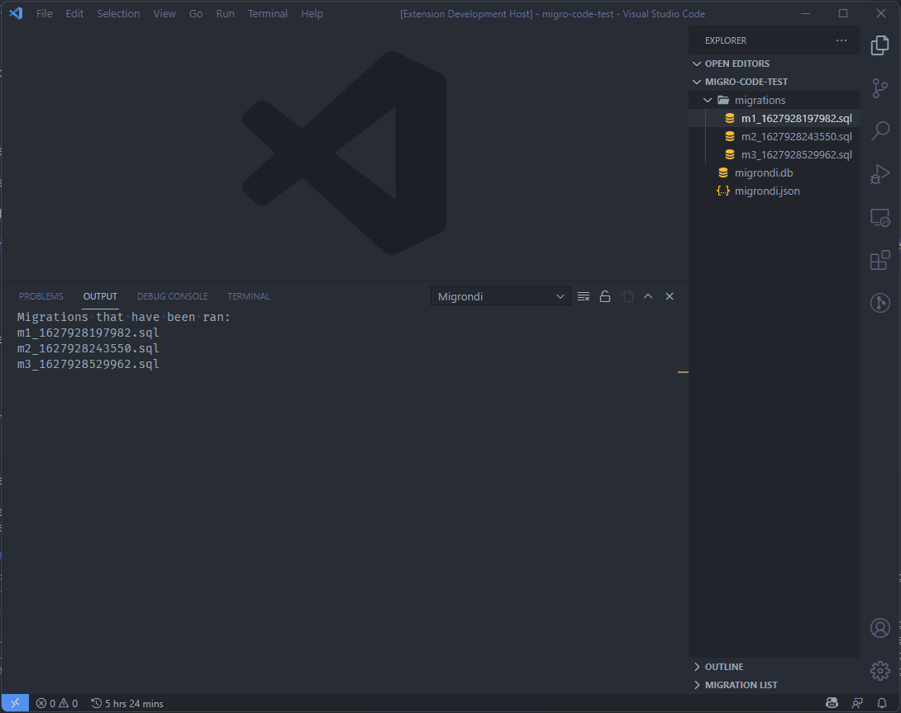

# Migrondi on VSCode

> For the full migrondi overview check https://github.com/AngelMunoz/Migrondi

Migrondi is a SQL Migrations tool designed to be simple and execute simple migrations.
Write SQL and execute SQL against your database.

> Migrondi Runs on Linux-x64, Linux-arm64, Windows-x64, and MacOS-x64 (intel based)

## Features

Use the full suite of [Migrondi]() commands 

### Init 
 

- connection

  This is a IDbConnection compatible connection string (you can find examples in the follwing links)

  - [SqlServer](https://www.connectionstrings.com/sql-server/)
  - [SQLite](https://www.connectionstrings.com/sqlite/)
  - [MySQL](https://www.connectionstrings.com/mysql/)
  - [PostgreSQL](https://www.connectionstrings.com/postgresql/)

- migrationsDir

  this is an absolute or relative path to where the migrations will be stored.

- driver

  any of the following "mssql" "sqlite" "mysql" "postgres"

### New

### Up

### Down

## Known Issues

The output is designed with a CLI tool in mind, this will be adjusted in both migrondi-vscode and migrondi itself
